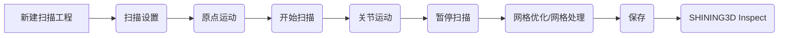

<!-- FILE_PATH: welcome.md -->
# 手册须知

本用户手册（以下简称“本手册”）主要介绍 Robot Scan Control 软件操作说明。

#### 符号说明

<div w3-include-html="https://doc-asset.shining3d.com/assets/htmls/symbol_convention_user_manual_cn.html"></div>

#### 知识产权及免责声明

<div w3-include-html="https://doc-asset.shining3d.com/assets/htmls/disclaimer_cn.html"></div>

---

<!-- FILE_PATH: getting-started.md -->
# 快速引导

本章节为 SHINING3D RobotScan Control 自动化系统软件的总览引导，方便您快速找到相应的操作帮助内容。

<div class="grid cards" markdown>

- 您可以在此了解本软件的功能、安装等相关内容。

    [:octicons-arrow-right-24: 这是一个什么样的软件？](introduction.md)

    [:octicons-arrow-right-24: 如何安装软件及有什么样的环境要求？](install.md)

    [:octicons-arrow-right-24: 软件界面的总体介绍](interface.md)

</div>

**当您成功安装软件后，软件使用的完整流程如下：**

<div class="grid cards" markdown>


- :material-numeric-1-box-multiple-outline:{ .lg .middle } **添加设备**

    ---

    在设计自动化工作流前，需要添加并连接设备。

    [:octicons-arrow-right-24: 如何添加及连接设备？](device-management/index.md)

- :material-numeric-2-box-multiple-outline:{ .lg .middle } **编排工作流**

    ---

    连接设备后，设计工作流并执行自动化任务。

    [:octicons-arrow-right-24: 如何编排自动化工作流？](programming.md)

</div>

---

<!-- FILE_PATH: device.md -->
# 设备外观

{ .center }

!!! sn3d-warn outline "注意"

    转台上的夹具和工件不在部件清单内，请自行配备。

## 底座

### 正面


#### ① 急停按钮

按下按钮**急停**后，结束流程，当前执行的的节点显示为红色，软件底部状态栏实时显示当前状态。

急停后，未收到急停恢复消息时，软件编程界面**开始**、**暂停**、**结束**按钮禁用，收到急停恢复消息后，界面**开始**按钮可用。

#### ② 开始按钮

| 场景               | 操作          | 功能描述                                                                                                                                                                       |
| :----------------- | :------------ | :----------------------------------------------------------------------------------------------------------------------------------------------------------------------------- |
| **与软件连接时**   | **短按**      | 等于软件编程界面中的**开始**操作。机器人将从当前选中的步骤开始执行。 |
| **未与软件连接时** | **长按 5 秒** | 标定板将自动弹出或收起。此功能仅在底座未与软件连接时响应。当底座与软件已建立连接时，此操作将不会有任何响应。                                                               |

#### ③ 复位按钮

| 场景               | 操作          | 功能描述                                                                                                                                                                                                                                                                                             |
| :----------------- | :------------ | :--------------------------------------------------------------------------------------------------------------------------------------------------------------------------------------------------------------------------------------------------------------------------------------------------- |
| **与软件连接时**   | **短按**      | 软件将弹出一个确认窗口，询问您是否要复位机械臂、转台并清除扫描数据。                                                                                                                                                                                                                                 |
| **与软件连接时**   | **长按 5 秒** | 立即执行以下操作：机器人复位、转台复位、并清除所有扫描数据。<li>**流程执行中：** 如果当前有正在进行的任务或流程，长按此按钮将立即终止当前执行，并进行上述复位和数据清除操作。<li>**流程未执行：** 如果当前没有正在进行的任务，长按此按钮将直接执行复位操作。如果之前有扫描数据，这些数据也将被清除。 |
| **未与软件连接时** | **长按 5 秒** | 机器人将复位到预设的打包位置。此功能仅在底座未与软件连接时响应。当底座与软件已建立连接时，此操作将不会有任何响应，软件将接管复位按钮的功能。                                                                                                                                              |

#### ④ 电源指示灯

底座上电后，电源指示灯将常亮。

### 背面


#### ① 以太网/网络接口

连接网线到电脑的网口，实现底座与软件、机器人等其他设备的有线通信。适用于 `FreeScan UE Pro2`。。

#### ② 电源输入接口

输入：200~240V; 50/60 Hz; 370W Max

!!! sn3d-warn outline "注意"

    请确保使用符合电压和电流标准的电源线，并将其牢固插入。

#### ③ 电源开关

用于控制底座的整体电源通断。

#### ④ USB 3.0 Type-B 接口

连接 USB 3.0 Type-B 到电脑的 USB 3.0 Type-A 接口。适用于 `FreeScan Combo`、`FreeScan Combo+`、`FreeScan UE Pro`。

{ .center width=300 }

---

<!-- FILE_PATH: introduction.md -->
# 软件介绍

作为一款自动化控制软件平台，RobotScan Control 无缝集成高精度工业 3D 扫描仪、协作机器人及多种硬件设备。通过统一直观的操作界面，轻松实现多设备协同控制。采用图形化编程设计，无需专业编程技能，通过简单的拖拽即可轻松搭建完整的自动化流程，持续获取零部件的全尺寸三维数据。同时对接三维检测软件，自动输出规范化检测报告，实现批量产品扫描检测，实现全自动化、标准化的的高精度三维检测流程，让复杂的检测流程变得简单高效。

## 软件应用

<div class="grid cards" markdown>

- :material-turbine:{ .lg .middle } __航空航天__

    ---

    检测高精度零部件和复杂曲面的形状和尺寸，确保产品的安全性和可靠性。

- :material-car:{ .lg .middle } __汽车工业__

    ---

    在生产过程中进行定期的三维检测，以监控生产线的稳定性和产品质量的一致性。

- :material-devices:{ .lg .middle } __3C 电子__

    ---

    通过三维扫描和测量，将实际零件转换为数字模型，用于产品设计修改、故障分析等。

- :material-tools:{ .lg .middle } __精密五金__

    ---

    对精密加工零件进行全尺寸检测和公差分析，保证加工精度和产品合格率。

- :octicons-ai-model-16:{ .lg .middle } __精密注塑__

    ---

    实现模具和注塑件的尺寸检测与变形分析，助力产品质量提升和工艺优化。

</div>

---

<!-- FILE_PATH: install.md -->
# 软件安装

## 运行环境

| 推荐配置 |                                  |
| :------: | :------------------------------: |
|  处理器  |  lntel® Core™ i7-13700H 或以上   |
|   显卡   | NVIDIA RTX 4060 Laptop GPU 或以上 |
|   显存   |           8 GB 或以上            |
|   内存   |           64 GB 或以上           |
| 操作系统 |        Windows 11 (64 位)        |

!!! sn3d-info outline "说明"

    - 为保证软件正常运行，请使用英伟达（NVIDIA）显卡。
    - 软件安装时需要使用管理员权限。初始安装环境时间可能较长，请耐心等待。
    - 请勿将软件安装在 **C:\Program Files 或 C:\Program Files (x86)** 目录下，以免由于权限问题无法正常启动软件。

<!-- ## 安装软件

请双击安装包，并根据软件中的安装向导完成软件的安装。

!!! sn3d-info  outline "说明" -->

---

<!-- FILE_PATH: interface.md -->
# 软件界面

## 界面总览


### 菜单栏

### ① 文件

支持  新建、 打开、 保存、 另存为解决方案（*.rsc）。

若要打开最近文件，点击  右侧的 ，将展开最近文件列表。

!!! sn3d-info outline "说明"

    - 新建的解决方案使用默认名称命名和默认路径存放。
    - 默认名称为 **Project_1**，每新建一个解决方案，数字递增一次。
    - 默认路径为 **C:\Users\当前登录用户的用户名\Documents\RobotScan Control\Solution**，可以在**设置**内修改。

### ② 设置

| 设置项                     | 说明                                               |
| -------------------------- | -------------------------------------------------- |
| 选择语言                   | 修改界面语言，支持中文、英文和德语。               |
| 工程保存路径               | 修改工程的默认路径。不支持需要管理员权限的文件夹。 |
| 开机时自动启动             | /                                                  |
| 新建工程时导入上次工程程序 | /                                                  |

### ③ 帮助

用户手册：点击即可打开本用户手册。

快捷操作：具体参见[快捷操作](shortcut.md)。

### 日志

反馈执行信息，格式为 `yyyy-MM-dd HH:mm:ss 日志等级 日志信息`。

## 设备配置

用于添加、配置和连接设备；在设备连接后，还可以查看设备连接状态。

支持将添加的设备等信息保存为模板，以便后续快速套用。

## 标定

用于校准设备的扫描精度，保持设备的扫描质量。

## 编程

通过图形化的节点连接方式进行[编程](programming.md)。支持拖拽和连接各种节点到画布上来构建和编辑一系列动作和指令。

---

<!-- FILE_PATH: shortcut.md -->
# 快捷操作

| 全局                  |                    |
| --------------------- | ------------------ |
| 保存工程              | ++ctrl+s++         |
| 复制                  | ++ctrl+c++         |
| 粘贴                  | ++ctrl+v++         |
| 剪切                  | ++ctrl+x++         |
| 删除                  | ++delete++         |
| 编组                  | ++ctrl+g++         |
| 取消编组              | ++ctrl+backspace++ |
| 编组重命名            | ++f2++             |
| **节点视图&扫描视图** |                    |
| 缩放                  | 滚轮               |
| 平移                  | 中键               |
| 垂直方向滚动          | ++ctrl+"滚轮"++    |
| 水平方向滚动          | ++shift+"滚轮"++   |
| 多选                  | ++shift+"左键"++   |
| 框选                  | 左键拖拽           |
| **检测视图**          |                    |
| 缩放                  | ++ctrl+"滚轮"++    |

---

<!-- FILE_PATH: device-management/index.md -->
# 设备管理

RobotScan Control 支持连接并控制多种型号的机器人、扫描仪、转台等设备的使用。

## 添加设备


新建工程后，默认自动添加扫描仪、转台和机器人。


## 连接设备

<!-- 1. 在设备列表中找到您需要连接的设备，或选择模板并应用。 -->
1. 配置设备信息。

    
    - **华沿机器人**：输入 IP 地址 192.168.40.10（端口默认 10003，不可修改）。
    

        !!! sn3d-info "说明"

            - 电脑网口需与机器人的 IP 地址处于同一网段。
            
            - 输入 IP 地址后，点击**配置**可以打开机器人后台管理页面（输入的 IP 地址 + dist，如 192.168.40.10/dist）。

    - **转台**：输入 0 位补偿值（即目标角度和实时角度的补偿值）。

        !!! sn3d-warn outline "注意"

            修改 0 位补偿值将影响后续转台编程。

    - **扫描仪**：选择扫描软件的本地路径。

    

2. 点击**一键连接**按钮，提示**{style="vertical-align:text-bottom"}验证通过**后，设备将自动连接。若验证失败，请重试。

    |                                      图标                                      |   状态   |
    | :----------------------------------------------------------------------------: | :------: |
    |  | 未连接 |
    |  | 连接成功 |

    !!! sn3d-info "说明"

        - 连接扫描设备前，请确保设备已经获得授权并激活。
        - 若扫描设备离线，软件将自动尝试重新连接。

    !!! sn3d-warn "注意"

        华沿机器人连接成功后，此时不可用。需在机器人设备卡片上点击**开启**，等待机器人上电完成后，继续点击**使能**才能使用。

    | 文字         | 状态                           | 说明                                 |
    | ------------ | ------------------------------ | ------------------------------------ |
    | 开启         | 连接机器人成功，机器人未上电   | 点击后，机器人上电                   |
    | 使能         | 连接机器人成功，机器人上电成功 | 点击后，机器人可进行示教、执行工作流 |
    | 去（除）使能 | 连接机器人成功，机器人已使能   | 点击后，机器人无法运动               |
    | 关闭         | 连接机器人成功，机器人上电成功 | 点击后，关闭机器人电源               |


---

<!-- FILE_PATH: device-management/3d-connexion.md -->
# 3D 鼠标

您可以通过 3D 鼠标，在机器人点位录制时操控机器人进行快速平移和旋转操作，代替手动示教。

更多信息请见 [3Dconnexion 用户手册](https://3dconnexion.com/cn/manuals/)。

## 鼠标连接

将 SpaceMouse Wireless 的 USB 接收器插入电脑的 USB 端口，即可在本软件内使用。

## 操作说明

!!! sn3d-warn outline "注意"

    - 仅在机器人命令进行点位录制时可以通过 3D 鼠标操控机器人。
    - 鼠标左键保存点位，鼠标右键退出录制。

|                                                 图示                                                  | 描述                                                                                      |
| :---------------------------------------------------------------------------------------------------: | :---------------------------------------------------------------------------------------- |
|  | 通过左右推动按钮控制：<li>机器人末端，X 正负平移<li>单轴运动，第 1 关节轴                 |
|  | 通过前后推动按钮控制：<li>机器人末端，Y 正负平移<li>单轴运动，第 2 关节轴                 |
|  | 通过上下推动按钮控制：<li>机器人末端，Z 正负平移<li>单轴运动，第 3 关节轴                 |
|  | 通过向左或向右倾斜按钮控制：<li>机器人末端，RX 正负平移<li>单轴运动，第 4 关节轴          |
|  | 通过向前或向后倾斜按钮控制：<li>机器人末端 Y 轴旋转，RY 正负平移<li>单轴运动，第 5 关节轴 |
|  | 通过旋转按钮控制：<li>机器人末端 X 轴旋转，RZ 正负平移<li>单轴运动，第 6 关节轴           |

---

<!-- FILE_PATH: calibration/index.md -->
# 标定须知

标定即对设备的校准。通过标定重新计算设备参数，既能确保设备的精度，又能保证设备扫描质量。

!!! sn3d-info outline "说明"

    - 若您有以下情况，请进行标定：

    - 扫描仪在运输过程中被严重晃动或震动。
    - 扫描仪放置一段时间（1~2 周）后再使用。
    - 扫描过程中，扫描数据不完整，数据质量严重下降。
    - 扫描精度严重下降，如频繁出现拼接错误、不识别标志点等现象。

!!! sn3d-warn outline  "注意"

    - 请勿使用任何化学液体擦拭标定器具。
    - 标定器具使用完后，请及时收纳放好。
    - 标定器具只用于标定，不做其他用途。
    - 请勿将重物或杂物放置于标定器具上。
    - 请将标定器具放置在远离腐蚀性溶液、金属和尖锐物体的位置。
    - 请确保标定器具上的标定点无损坏或脏污，标定板正面干净无划痕。
    - 在标定前或标定过程中，请确保扫描仪和跟踪仪同时在线。
    - 设备上电后，请进行充分热机再进行标定操作，以保证设备的精度稳定性。


---

<!-- FILE_PATH: calibration/operation.md -->
# 标定操作

请根据界面标定向导，按步骤操作。


1. 拖动标定模板到画布，自动生成标定命令。


    

    
    !!! sn3d-warn outline "注意"

        修改模板内的标定命令参数不会保存到标定模板，需手动保存方案。
    

2. 点击  开始执行命令。

3. 底座标定板弹出时放入标定板，正面朝上水平放置。

    { .center width=400 }

    图片仅供示意，具体设备以实际为准
    { .center style="font-size:small" }

4. 切换到**手持标定**标签页，查看标定进度。

5. 标定过程中，确保将设备的蓝圈与标定板的灰色圆圈对齐，标定提示框都变成绿色。

6. 提示标定成功后，即完成标定。


!!! sn3d-info "说明"

    - 若标定不成功，可以修改**关节运动**命令的点位后重试。
    - 若多次尝试后仍然无法成功标定，请联系供应商或者[技术支持](../contact.md)。


---

<!-- FILE_PATH: programming.md -->
# 编程

在实际操作自动化设备进行扫描和检测时，需要事先编辑好机器人将要自动执行的一系列动作和命令。Robotscan Control 使用工作流引擎，更好地呈现了程序的上下文逻辑；通过创建命令、连接命令、编辑命令参数等操作，只需拖动操作和输入少量参数即可完成编程；有助于更好地可视化代码并更快地编写复杂和重复性任务的脚本，实现低门槛的自动化任务编程。

## 示例





快速扫描模板
{ .center }

## 界面预览


### 工作界面

视图：视图即标签页，你可以拖拽视图以成为独立窗口。

- 节点视图：用于放置和连接命令。
- 检测视图：用于查看检测报告。
- 扫描视图：用于查看扫描结果。

命令列表：包含所有可用命令的列表，你可以从这里拖动命令到画布上。

程序列表：用于保存和管理你已经组合好的命令。你可以查看、新建或导入不同的程序文件，方便复用和分享。


参数面板：显示选中命令的参数设置。

### 命令界面

Robotscan Control 中的所有命令都基于类似的结构。该界面适用于任何类型的命令。

#### 标题

标题显示命令的名称/类型。标题右侧是用于[调试](#_16)的跳过和断点按钮。

{ .center width=300 }

#### 状态

标题下方显示命令的当前状态，包括未执行、执行中、执行完成、执行失败。

| 状态     | 示例                                                                   |
| -------- | ---------------------------------------------------------------------- |
| 未执行   |        |
| 执行中   |     |
| 执行完成 |  |
| 执行失败 |      |

#### 输入

输入位于命令的左侧。

#### 输出

输出位于命令的右侧，并且可以连接到另一个命令的输入。

#### 参数

许多命令的参数可能会影响它们与输入和输出交互的方式。

<figure markdown="span">
  { width=200 }
  <figcaption>机器人直线运动命令的参数设置。</figcaption>
</figure>

## 操作

### 创建命令

从命令列表中拖动你需要的命令到画布上。

### 连接命令

两种方式可以连接命令：

- 从画布上选中一个命令的输出端口，拖拽到另一个命令的输入端口，释放鼠标即可完成连接。
- 点击一个端口，出现连接线，移动至画布空白区域，再次点击出现命令列表，选择一个命令，即可完成连接。

某些命令可以接受多个输入或输出，你可以将多个命令连接到同一个命令上，或者将一个命令的输出连接到多个命令。

### 编辑命令

在画布上点击选中一个命令，或使用 ++shift+"左键"++ / 框选选中多个命令后，点击右键在菜单中选择一个操作：单步执行/编组/复制/粘贴/剪切/删除或使用快捷键。

| 名称     | 快捷键     |
| -------- | ---------- |
| 单步执行 | /          |
| 编组     | ++ctrl+g++ |
| 复制     | ++ctrl+c++ |
| 粘贴     | ++ctrl+v++ |
| 剪切     | ++ctrl+x++ |
| 删除     | ++delete++ |

!!! sn3d-info "说明"

    命令之间的连接会随命令一同复制。

选中画布上的某个命令，在右侧参数面板中编辑命令参数。

### 编组命令

为简化复杂工作流并实现重复操作，Robotscan Control 允许用户将多个命令编组。


编组操作：选中画布上的多个命令（支持多选或框选），通过右键菜单选择**编组**或使用快捷键 ++ctrl+g++ 完成编组。

循环控制：编组命令后，可通过右侧参数面板设置组内命令的循环执行次数。

编组重命名：选中编组后，可右键点击或按下 F2 快捷键进行重命名。

编辑编组：点击编组命令中的 { style="vertical-align:bottom" } 可以在新视图中查看并编辑组内的命令。

### 执行命令

1. 选择执行方式：

    - **单步执行**：执行当前选中命令，并停止。该模式通常用于调试目的，你可以逐步执行工作流的每一个命令，检查每一步的输出，以便发现错误或优化流程。
    - **连续执行**：执行第一个命令，并继续执行下一个命令，直到最后一个命令执行完毕。

2. 设置执行次数（可选）：

    若选择**连续执行**方式，可以根据实际需要，勾选**循环**并输入循环次数。所有命令执行完毕后将继续从头开始执行直到循环次数执行完毕。

3. 开始执行：

    - **连续执行**：点击 :fontawesome-solid-play: **开始**按钮，根据执行模式执行当前工作流。
    - **单步执行**：点击 :fontawesome-solid-play: **开始**按钮或双击命令执行当前步骤。

4. 时间轴将显示当前执行的次数和运行的时间。

|              按钮              | 说明                                     |
| :----------------------------: | :--------------------------------------- |
| :fontawesome-solid-play: 开始  | 开始执行当前工作流。                     |
| :fontawesome-solid-pause: 暂停 | 暂停当前正在执行的命令。                 |
| :fontawesome-solid-stop: 停止  | 停止当前正在执行的命令，并退出执行状态。 |

!!! sn3d-warn "注意"

    开始执行后，不能切换执行模式，不能添加、连接和编辑命令。

### 调试命令

{style="vertical-align: text-bottom;"}跳过：在调试时暂时忽略某个或某几个命令的执行，直接跳过这些命令，继续执行后续的命令。

{style="vertical-align: text-bottom;"}断点：在调试时，在某个命令上设置断点，当执行到该命令时，程序将暂停执行。

---

<!-- FILE_PATH: inspect.md -->
# 检测

通过预设的检测程序，系统能自动执行扫描、检测及报告输出等全流程操作，实现全自动、批量化的全尺寸检测，快速获取工件的准确三维数据。

结束扫描，对扫描数据进行网格处理和保存后，添加检测命令，如 SHINING 3D Inspect，配置好各个路径，勾选**PDF**和**打开检测报告（PDF）**，当流程执行到该命令且执行成功后，自动保存并在**检测视图**显示检测报告。

## 工作流示例


## 检测报告示例

{ width=500 .center }

---

<!-- FILE_PATH: command.md -->
# 命令列表


## 转台命令

=== "转台原点运动"

    - 角度：0 ~ 360°
    - 速度：1 ~ 100%。
    - 加速度/ms/(60r/min)：80 ~ 9999。

=== "转台运动"

    - 角度：0 ~ 360°
    - 相对角度：默认开启，基于当前位置转动指定角度。
    - 速度：1 ~ 100%。
    - 加速度/ms/(60r/min)：80 ~ 9999。

## 机器人命令

!!! sn3d-info "说明"

    - 点位即机器人运动停止时的最终坐标。
    - 录制点位时，需要确保机器人处于使能状态。

=== "原点运动"

    获取当前点位：获取当前实时位置为 home 点。
=== "直线运动"

    机器人末端沿一条直线移动。

    - 速度：1 ~ 100%。
    - 加速度：1 ~ 2500 mm/s²。
    - 直线速度：1 ~ 2000 mm/s。
    
    - 过渡半径：50 mm
    
    - 点位录制间隔：默认 5 秒，即每隔 5 秒录制一个点位，最长支持 60 秒。
    - 机器人点位生成：

        === "手动"

            勾选**自动录制**后，点击软件上的开始录制，移动机器人到想要的位置，保持点位录制间隔设置的时间不动，软件就会记录点位。

        === "3D 鼠标"

            3D 鼠标在线时，默认使用 3D 鼠标录制点位。

            鼠标左键保存点位，鼠标右键退出录制。
=== "关节运动"

    机器人末端沿一条不规则的曲线移动。

    - 速度：1 ~ 100%。
    - 加速度：1 ~ 360°/s²。
    - 关节速度：1 ~ 180°/s，默认 90°/s。
    
    - 过渡半径：50 mm
    
    - 点位录制间隔：默认 5 秒，即每隔 5 秒录制一个点位，最长支持 60 秒。
    - 机器人点位生成：

        === "手动"

            勾选**自动录制**后，点击软件上的开始录制，移动机器人到想要的位置，保持点位录制间隔设置的时间不动，软件就会记录点位。

        === "3D 鼠标"

            3D 鼠标在线时，默认使用 3D 鼠标录制点位。

            鼠标左键保存点位，鼠标右键退出录制。


=== "通用运动"

    在每个点位设置运动方式。默认关节运动，可修改为直线运动。

    
    - 自动扫描：开启后无需添加**开始扫描**命令，到达点位后自动采图。
    
    - 点位录制间隔：默认 5 秒，即每隔 5 秒录制一个点位，最长支持 60 秒。
    - 机器人点位生成：

        === "手动"

            勾选**自动录制**后，点击软件上的开始录制，移动机器人到想要的位置，保持点位录制间隔设置的时间不动，软件就会记录点位。

        === "3D 鼠标"

            3D 鼠标在线时，默认使用 3D 鼠标录制点位。

            鼠标左键保存点位，鼠标右键退出录制。

## 标定命令


=== "进入标定"

    标定的第一个命令。

=== "开始标定"

    开始标定。

=== "标定计算"

    计算标定。
=== "退出标定"

    退出标定。
=== "标定板弹出"

    弹出底座内部的标定板。

=== "标定板收起"

    将弹出的标定板收到底座内部。


## 扫描仪命令


=== "快速扫描模板"

    ```mermaid
    graph LR
        A[新建扫描工程] --> B(扫描设置);
        B --> C(原点运动);
        C --> D(开始扫描);
        D --> E(关节运动);
        E --> F(暂停扫描);
        F --> G(网格优化/网格处理);
        G --> H(保存);
        H --> I(SHINING3D Inspect);
    ```


=== "新建扫描工程"

    - 扫描模式：扫描模式为激光扫描。该参数无法修改。
    - 名称：工程组名称。

        - [ ] 保留备份：

            - 若勾选，每次保存时会生成一个备份文件。
            - 若不勾选，多次执行命令，只会保留最后一次新建的工程。

    - 默认路径：设置工程组保存的默认路径。


=== "扫描设置"

    - 扫描模式：
        - 扫描网格：该模式用于直接扫描生成网格数据，适用于大多数扫描场景。
        - 扫描框架点：该模式用于扫描物体表面的标志点数据。通过采集标志点，可快速获取物体的框架点数据。扫描完成后可保存数据或切换至扫描网格模式继续扫描增加网格扫描的便捷性。

    - 点距：点距越小，模型细节越多；反之，点距越大，模型细节越少。

    - 光源模式：

        - 50 线：主要用于对大型物体的快速扫描。
        - 7 线：主要用于精细扫描。
        - 1 线：主要用于深孔和缝隙扫描。

    - 扫描对象：根据不同物体材质选择不同的扫描对象模式，包括**普通**和**反光**。
    - 亮度：拖动滑块调节扫描亮度，直到重建出较完整的激光数据。若亮度太亮，则扫描数据会出现较多噪声。
    - 强光模式：开启后可在强光环境（如户外）下正常扫描获取物体数据。

        !!! sn3d-info outline "说明"

            扫描物体请避免阳光直射。

    - 质量色谱：以色谱的形式展示扫描质量，蓝色代表扫描到的数据质量高，黄色代表扫描不充分，需要进一步扫描。扫描不充分的数据在数据处理后可能会消失或显示异常。
    - 点云模式：开启后扫描过程将显示点云数据，减少显存消耗。
    - 局部视角：开启后扫描界面只展示扫描物体的局部视角，可用于对细小孔洞的补充扫描。
    - 视角锁定：开启后扫描界面的三维场景将不再跟随扫描仪的移动而变化，可用于扫描物体的当前面。


=== "导入框架点"

    选择框架点文件（.p3, .txt, .asc, .dgm）的本地路径。


=== "优化框架点"

    优化框架点数据。
=== "开始扫描"

    开始扫描。


=== "暂停扫描"

    暂停扫描。


=== "清空数据"

    删除当前工程中的所有扫描数据。

=== "网格优化/网格处理"

    封装模式：选择**网格处理**或**网格优化**。


    封装参数：

    |图标 | 功能 | <center>描述</center>|
    |:------:|:------:|----------|
    ||非封闭模型 | 未封闭孔洞的模型，保持扫描数据原始状态，封装处理耗时较短。|
    ||半封闭模型 | 部分孔洞会被封闭的模型。 |
    ||全封闭模型 | 全部孔洞都会被封闭的模型，此类模型可以直接用于 3D 打印。<br>仅全封闭模型可以设置**模型质量**：**高**、**中**（默认）、**低**。|


    **网格处理：**

    
    - **优化**：优化数据，减少杂数据。设置级别较高时会丢掉部分小细节。
        - 无：不做优化。
        - 标准：轻量优化数据，尽量保留数据的表面特征。
        - 中：减少数据表面的杂数据。
        - 高：减少杂数据的同时使数据更加平滑。
    

    - **平滑**：对数据进行去噪处理，使网格数据更加光滑，改善数据质量。
        - 当**优化**选择**无**时，此项功能不可用。

    - **去孤立面**：删除任何与主体数据不相连的小面片数据。
        - 调整滑块或者点击上下箭头设置去孤立面数据比例，0 表示不去除孤立面。

    


    - **边界优化**：勾选后，进行封装时将优化边界数据，使封装后的边界数据更加完整平滑。

        !!! col _2 center

              
            优化前

        !!! col _2 center clear

              
            优化后


    - **最大面片数**：设置一个最大网格面片数量值作为生成网格时进行数据简化的上限。
        - 请合理输入该值，避免过度简化导致数据质量变差。

    - **补小洞**：根据设置的补洞周长自动填补小洞。
        - 默认对周长 ≤ 10 mm 的小洞进行补洞，可根据需要调整。

    - **去尖刺**：删除钉状物，检测并展平多边网格上的单点尖峰。

    - **标志点补洞**：填补因被标志点覆盖，导致未被扫描到的物体表面孔洞。

    - **推荐参数**：开启推荐参数则软件会根据不同模型计算不同的优化参数；关闭推荐参数，则使用自定义参数。


=== "保存数据"

    
    保存类型：支持 STL、P3、ASC、OBJ、PLY 和 3MF 格式。
    

    - 名称：模型文件的名称。

    - [ ] 保留备份：

        - 若勾选，每次保存时会生成一个备份文件。
        - 若不勾选，多次执行命令，只会保留最后一次新建的工程。

    - [ ] 使用 SN 号：

        连接到外部控制器后，通过 modbus 协议将产品 SN 号传输给 RC 软件，保存 STL 文件时将在自定义名称后追加 SN 号。

    - 保存路径：点击**选择**，在文件资源管理器内选择一个文件夹作为模型文件的保存路径。


## 检测命令

使用 SHINING3D Inspect 检测命令前，请确认具备软件授权，否则将无法使用该命令生成检测报告。

=== "SHINING3D Inspect"

    - exe 程序路径：选择 SHINING3D Inspect exe 程序所在路径。
    - 检测模板路径：选择 SHINING3D Inspect 的工程文件（*.SNIProj），即检测模板。
    - 报告导出路径：选择检测报告的保存路径。
    - 报告导出格式
        - [x] PDF
            - [x] 打开检测报告（PDF）：扫描完毕后在检测界面自动打开检测报告。
        - [x] CSV
    - [ ] 是否保存检测工程
    - [ ] 共享内存
    - [ ] 覆盖上一次报告
=== "PolyWorks"

    - 检测软件：默认检测软件为 PolyWorks。
    - exe 程序路径：选择 PolyWorks exe 程序所在路径。
    - 工作区路径：选择 PolyWorks 工作区的路径。
    - 报告导出路径：选择检测报告的保存路径。
    - 宏脚本：选择 PolyWorks 的宏脚本所在路径。
    - [x] 打开检测报告

## 其它命令

=== "等待时间"

    等待时间：在命令之间插入指定的等待时间（ms）。
=== "自定义提示"

    输入长度为1~50字符的文本。当执行到该节点时，将弹出文本提示，同时暂停执行流程。点击确认后继续执行流程。

    
=== "mes 系统对接"

    带参数调用外部程序。

    - 外部 exe 路径：选择 mes 客户端 exe 文件所在的路径。
    - 外部 exe 自定义参数：添加启动参数。不支持特殊字符。

---

<!-- FILE_PATH: contact.md -->
# 联系我们

<div w3-include-html="https://doc-asset.shining3d.com/assets/htmls/freescan_contact_cn.html"></div>